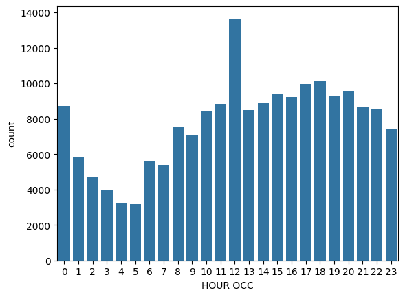

# Crime Analysis in los angeles

Los Angeles, California 😎. The City of Angels. Tinseltown. The Entertainment Capital of the World! 

Known for its warm weather, palm trees, sprawling coastline, and Hollywood, along with producing some of the most iconic films and songs. However, as with any highly populated city, it isn't always glamorous and there can be a large volume of crime. That's where you can help!

You have been asked to support the Los Angeles Police Department (LAPD) by analyzing crime data to identify patterns in criminal behavior. They plan to use your insights to allocate resources effectively to tackle various crimes in different areas.

## The Data

They have provided you with a single dataset to use. A summary and preview are provided below.

It is a modified version of the original data, which is publicly available from Los Angeles Open Data.

# crimes.csv

| Column     | Description              |
|------------|--------------------------|
| `'DR_NO'` | Division of Records Number: Official file number made up of a 2-digit year, area ID, and 5 digits. |
| `'Date Rptd'` | Date reported - MM/DD/YYYY. |
| `'DATE OCC'` | Date of occurrence - MM/DD/YYYY. |
| `'TIME OCC'` | In 24-hour military time. |
| `'AREA NAME'` | The 21 Geographic Areas or Patrol Divisions are also given a name designation that references a landmark or the surrounding community that it is responsible for. For example, the 77th Street Division is located at the intersection of South Broadway and 77th Street, serving neighborhoods in South Los Angeles. |
| `'Crm Cd Desc'` | Indicates the crime committed. |
| `'Vict Age'` | Victim's age in years. |
| `'Vict Sex'` | Victim's sex: `F`: Female, `M`: Male, `X`: Unknown. |
| `'Vict Descent'` | Victim's descent:<ul><li>`A` - Other Asian</li><li>`B` - Black</li><li>`C` - Chinese</li><li>`D` - Cambodian</li><li>`F` - Filipino</li><li>`G` - Guamanian</li><li>`H` - Hispanic/Latin/Mexican</li><li>`I` - American Indian/Alaskan Native</li><li>`J` - Japanese</li><li>`K` - Korean</li><li>`L` - Laotian</li><li>`O` - Other</li><li>`P` - Pacific Islander</li><li>`S` - Samoan</li><li>`U` - Hawaiian</li><li>`V` - Vietnamese</li><li>`W` - White</li><li>`X` - Unknown</li><li>`Z` - Asian Indian</li> |
| `'Weapon Desc'` | Description of the weapon used (if applicable). |
| `'Status Desc'` | Crime status. |
| `'LOCATION'` | Street address of the crime. |


# Import required libraries
```python
import pandas as pd
import numpy as np
import matplotlib.pyplot as plt
import seaborn as sns
crimes = pd.read_csv("crimes.csv", dtype={"TIME OCC": str})
crimes.head()
```
**Output:**

```
       DR_NO   Date Rptd    DATE OCC TIME OCC    AREA NAME        Crm Cd Desc  Vict Age Vict Sex Vict Descent Weapon Desc  Status Desc                            LOCATION
0  220314085  2022-07-22  2020-05-12     1110    Southwest  THEFT OF IDENTITY        27        F            B         NaN  Invest Cont  2500 S  SYCAMORE                AV
1  222013040  2022-08-06  2020-06-04     1620      Olympic  THEFT OF IDENTITY        60        M            H         NaN  Invest Cont  3300    SAN MARINO              ST
2  220614831  2022-08-18  2020-08-17     1200    Hollywood  THEFT OF IDENTITY        28        M            H         NaN  Invest Cont                1900    TRANSIENT
3  231207725  2023-02-27  2020-01-27     0635  77th Street  THEFT OF IDENTITY        37        M            H         NaN  Invest Cont  6200    4TH                     AV
4  220213256  2022-07-14  2020-07-14     0900      Rampart  THEFT OF IDENTITY        79        M            B         NaN  Invest Cont  1200 W  7TH                     ST
```

---

## 2 — Data Exploration

```python
crimes.info()
```

**Output:**

```
<class 'pandas.core.frame.DataFrame'>
RangeIndex: 185715 entries, 0 to 185714
Data columns (total 12 columns):
 #   Column        Non-Null Count   Dtype
---  ------        --------------   -----
 0   DR_NO         185715 non-null  int64
 1   Date Rptd     185715 non-null  object
 2   DATE OCC      185715 non-null  object
 3   TIME OCC      185715 non-null  object
 4   AREA NAME     185715 non-null  object
 5   Crm Cd Desc   185715 non-null  object
 6   Vict Age      185715 non-null  int64
 7   Vict Sex      185704 non-null  object
 8   Vict Descent  185705 non-null  object
 9   Weapon Desc    73502 non-null  object
 10  Status Desc   185715 non-null  object
 11  LOCATION      185715 non-null  object
dtypes: int64(2), object(10)
memory usage: 17.0+ MB
```

> **Key observations:**
> - **185,715 records** total
> - `Weapon Desc` has significant missing values — only **73,502** out of 185,715 (60% missing), meaning most crimes involve no weapon
> - `Vict Sex` and `Vict Descent` each have ~11 missing values (negligible)

---

## 3 — Feature Engineering: Hour of Occurrence

```python
crimes["HOUR OCC"] = crimes["TIME OCC"].str[:2].astype(int)
crimes.head()
```

**Output:**

```
       DR_NO   Date Rptd    DATE OCC TIME OCC    AREA NAME        Crm Cd Desc  Vict Age Vict Sex Vict Descent Weapon Desc  Status Desc                            LOCATION  HOUR OCC
0  220314085  2022-07-22  2020-05-12     1110    Southwest  THEFT OF IDENTITY        27        F            B         NaN  Invest Cont  2500 S  SYCAMORE                AV        11
1  222013040  2022-08-06  2020-06-04     1620      Olympic  THEFT OF IDENTITY        60        M            H         NaN  Invest Cont  3300    SAN MARINO              ST        16
2  220614831  2022-08-18  2020-08-17     1200    Hollywood  THEFT OF IDENTITY        28        M            H         NaN  Invest Cont                1900    TRANSIENT        12
3  231207725  2023-02-27  2020-01-27     0635  77th Street  THEFT OF IDENTITY        37        M            H         NaN  Invest Cont  6200    4TH                     AV         6
4  220213256  2022-07-14  2020-07-14     0900      Rampart  THEFT OF IDENTITY        79        M            B         NaN  Invest Cont  1200 W  7TH                     ST         9
```

---

## 4 — Crime Frequency by Hour

```python
sns.countplot(x="HOUR OCC", data=crimes)
plt.show()
```

**Output:**
---



---

## 5 — Peak Crime Hour

```python
peak_hour = crimes["HOUR OCC"].value_counts()
peak_crime_hour = peak_hour.idxmax()
peak_hour.sort_values(ascending=False)
```

**Output:**

```
HOUR OCC
12    13663
18    10125
17     9964
20     9579
15     9393
19     9262
16     9224
14     8872
11     8787
0      8728
21     8701
22     8531
13     8474
10     8440
8      7523
23     7419
9      7092
1      5836
6      5621
7      5403
2      4726
3      3943
4      3238
5      3171
Name: count, dtype: int64
```

> ✅ **`peak_crime_hour = 12`** — Noon is the single busiest hour for crime in Los Angeles.

---

## 6 — Nighttime Crime Analysis (10 PM – 3 AM)

```python
night_time = crimes[crimes['HOUR OCC'].isin([22, 23, 0, 1, 2, 3])]
```

```python
peak_night_crime_location = (
    night_time.groupby("AREA NAME", as_index=False)["HOUR OCC"]
    .count()
    .sort_values("HOUR OCC", ascending=False)
    .iloc[0]["AREA NAME"]
)
print(peak_night_crime_location)
```

**Output:**

```
Central
```

> ✅ **`peak_night_crime_location = "Central"`** — The Central division records the highest crime volume during nighttime hours (10 PM – 3 AM).

---

## 7 — Victim Age Analysis

```python
age_bins   = [0, 17, 25, 34, 44, 54, 64, np.inf]
age_labels = ["0-17", "18-25", "26-34", "35-44", "45-54", "55-64", "65+"]

crimes["Age Bracket"] = pd.cut(crimes["Vict Age"], labels=age_labels, bins=age_bins)
```

```python
victim_ages = crimes["Age Bracket"].value_counts()
print(victim_ages)
```

**Output:**

```
Age Bracket
26-34    47470
35-44    42157
45-54    28353
18-25    28291
55-64    20169
65+      14747
0-17      4528
Name: count, dtype: int64
```

> ✅ **Most victimized age group: 26–34** with **47,470 incidents** — nearly 25.6% of all crimes.

---

## 📊 Summary of Findings

| Question | Answer |
|---|---|
| 🕛 Peak crime hour | **12 PM (noon)** — 13,663 incidents |
| 🌙 Highest nighttime crime area | **Central** division |
| 👤 Most victimized age group | **26–34** years old — 47,470 incidents |

---

